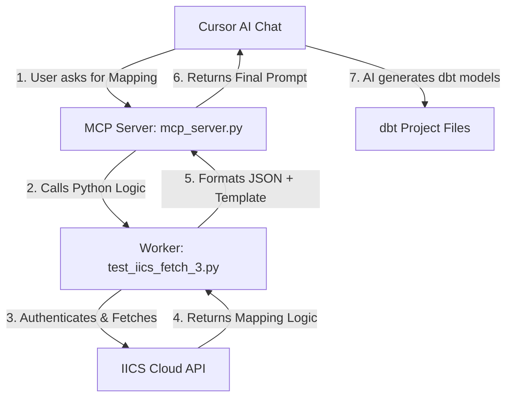

# IICS to dbt Generator: MCP Integration Guide

This document explains how the IICS (Informatica Intelligent Cloud Services) fetcher integrates with Cursor AI using the **Model Context Protocol (MCP)**. It is designed to help both technical and non-technical readers understand what we built.

---

## 1. What is MCP (Model Context Protocol)?

Think of **MCP** as a **Universal Bridge**.

Usually, an AI (like Cursor) is "trapped" in a box. It can see your code, but it cannot talk to your company's private APIs (like IICS) or run specialized local scripts.

**MCP** allows us to build a "Translator" (a Server) that tells the AI:
> *"Hey, I have a tool called `get_iics_prompt`. If you give me a Mapping Name, I will go talk to Informatica, fetch the logic, and give you back a perfect prompt to build dbt models."*

---

## 2. High-Level Architecture

The project consists of three main "Layers" working together:

---

## 3. The Files & Their Roles

### A. `mcp_server.py` (The Translator)
This file is the "face" of the project to Cursor AI. It uses the `mcp-python-sdk` to talk to the IDE.

*   **`handle_list_tools()`**: This function tells Cursor: *"I have a tool called `get_iics_prompt` and it needs one input: `mapping_name`."* This is why you see the tool appear in your Cursor settings.
*   **`handle_call_tool()`**: When you ask the AI to fetch a mapping, Cursor calls this function. It receives the name you typed and passes it to the "Worker" script.

### B. `test_iics_fetch_3.py` (The Worker)
This is where the actual "heavy lifting" happens. It doesn't know about MCP; it only knows how to talk to Informatica.

*   **`perform_login()`**: Handles the secure connection to IICS using your credentials.
*   **`get_iics_mapping_prompt(mapping_name)`**: The main brain. It:
    1.  Searches IICS for the mapping.
    2.  Exports the mapping configuration as a ZIP.
    3.  Parses the "Logic" out of the binary files.
    4.  Combines that logic with your `prompt_template.txt`.
*   **`preprocessor.py`**: A helper script that cleans up the messy Informatica XML/Binary data into clean, readable JSON for the AI.

### C. `prompt_template.txt` (The Instruction Manual)
This file tells the AI *how* to write the dbt code. It contains the rules for staging models, marts, and SCD Type 2 logic. The script injects the fresh IICS data into this template.

---

## 4. How the "Call" Actually Happens

1.  **Request**: You type in Cursor: *"Use the IICS Fetcher for Mapping_Test"*.
2.  **Discovery**: Cursor looks at its "Tools" list, finds the `iics-fetcher` we registered, and sees it has a tool that takes a `mapping_name`.
3.  **Execution**: Cursor runs a background command: 
    `python mcp_server.py` and sends a message through the system saying *"Call `get_iics_prompt` with `mapping_name='Mapping_Test'`"*.
4.  **Fetching**: The Python script logs into IICS, downloads the mapping, converts it to JSON, and wraps it in the template.
5.  **Return**: The huge block of text (the Prompt) is sent back to Cursor.
6.  **AI Action**: Cursor's LLM reads that massive prompt and suddenly "understands" your IICS logic. It then begins writing the `.sql` and `.yml` files in your project.

---

## 5. Why did we use absolute paths? (Technical Note)

When Cursor runs an MCP tool, it doesn't always "start" in the folder where the script lives. It might start in your dbt project folder. 

By using `os.path.abspath(__file__)`, we ensured that no matter where Cursor starts, the script will always be able to find `session.json` and `prompt_template.txt` because it calculates the path based on its own location on your `C:` drive.

---

## 6. How to explain this to others
> *"We built an MCP bridge that allows Cursor AI to 'reach out' and talk directly to our Informatica Cloud. Instead of us manually copying logic from IICS to Cursor, the AI now has a 'Fetch' tool. It logs into IICS, extracts the mapping math, and teaches itself how to build the corresponding dbt models in Snowflake automatically."*
