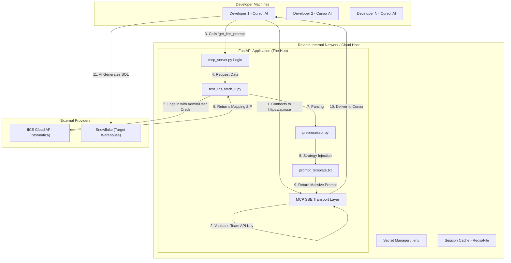

# Production Architecture: IICS-MCP Centralized Service

This diagram illustrates how the system works when hosted as a centralized **REST API (FastAPI)** for a team. In this setup, developers don't need local scripts; they only need a URL.

## High-Level Architecture Diagram

---

## Component Breakdown

### 1. Developer Layer (The Clients)
*   **Cursor AI**: Each developer configures their Cursor IDE once. Instead of pointing to a local Python file, they enter the **Remote URL** (e.g., `https://mcp.relanto.ai/sse`).
*   **Zero Setup**: No Python version issues, no library installations, and no `.env` files required on individual laptops.

### 2. The Hub (FastAPI Application)
*   **SSE Transport**: Unlike the local setup which uses "Standard I/O" (keyboard/screen), the REST API uses **Server-Sent Events (SSE)**. This is a standard way for a server to stream data back to the IDE.
*   **Centralized Logic**: The `prompt_template.txt` lives here. If you want to change how "Staging Models" are written for the *whole team*, you change it here once.
*   **Stability**: The server is always "on," meaning the first fetch is faster because the Python environment is already warmed up.

### 3. Governance & Security
*   **API Keys**: You can add a layer of security so only authorized Relanto IPs or developers with a specific API key can use the tool.
*   **Credential Management**: The central server pulls IICS credentials from a secure **Secret Manager** (instead of hardcoding them in scripts).
*   **Audit Logging**: You can see a dashboard of *who* fetched *which* mapping, allowing you to track usage and catch errors across the team.

### 4. External Services
*   **IICS API**: The server speaks to Informatica securely over HTTPS.
*   **Snowflake**: Once Cursor receives the prompt from the server, it writes the SQL directly into the local dbt project, which then talks to Snowflake.
